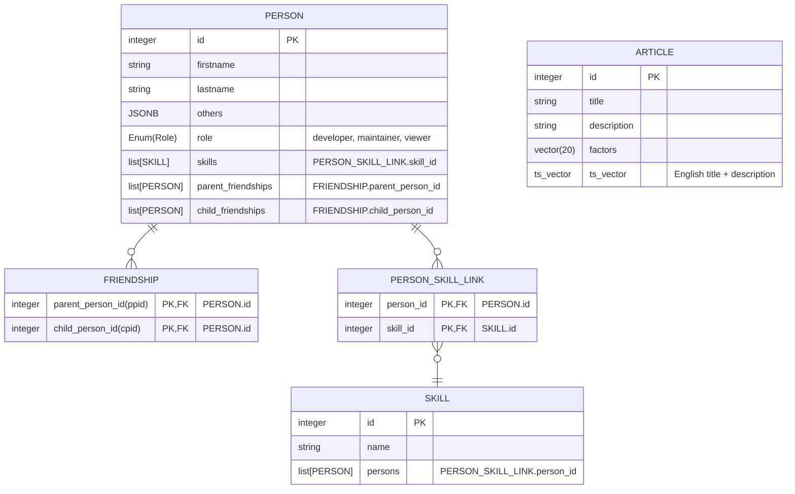

```mermaid
erDiagram
    a[PERSON] {
        integer id PK
        string firstname
        string lastname
        JSONB others
        Enum(Role) role "developer, maintainer, viewer"
        list[SKILL] skills "PERSON_SKILL_LINK.skill_id"
        list[PERSON] parent_friendships "FRIENDSHIP.parent_person_id"
        list[PERSON] child_friendships "FRIENDSHIP.child_person_id"
    }
    b[FRIENDSHIP] {
        integer parent_person_id(ppid) PK,FK "PERSON.id"
        integer child_person_id(cpid) PK,FK "PERSON.id"
    }
    c[SKILL] {
        integer id PK
        string name
        list[PERSON] persons "PERSON_SKILL_LINK.person_id"
    }
    d[PERSON_SKILL_LINK] {
        integer person_id PK,FK "PERSON.id"
        integer skill_id PK,FK "SKILL.id"

    }
    e[ARTICLE] {
        integer id PK
        string title
        string description
        vector(20) factors
        ts_vector ts_vector "English title + description"
    }
    a||--o{b : ""
    a||--o{d : ""
    d}o--||c : ""

```
